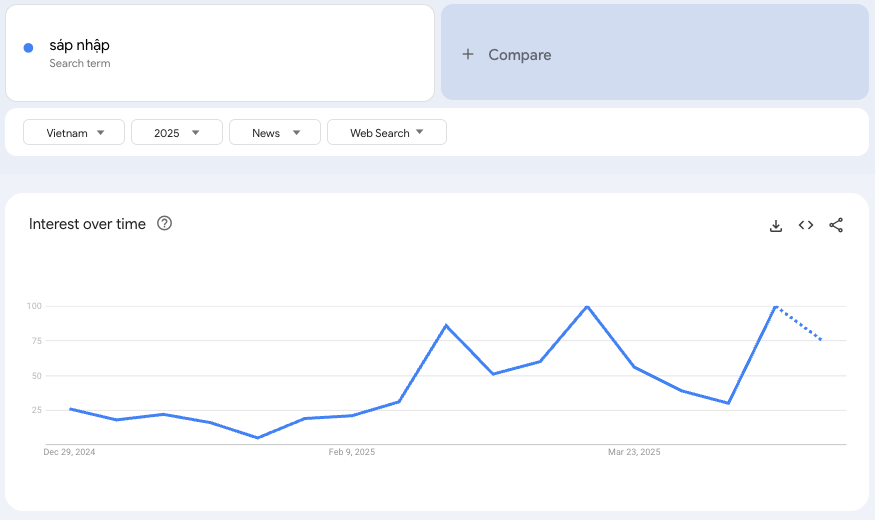
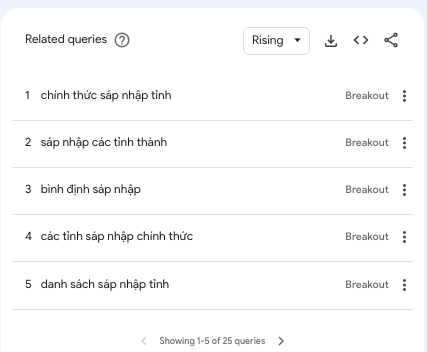
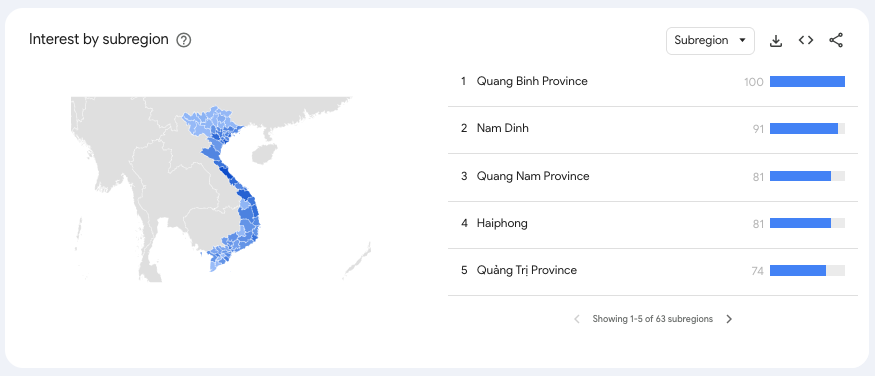
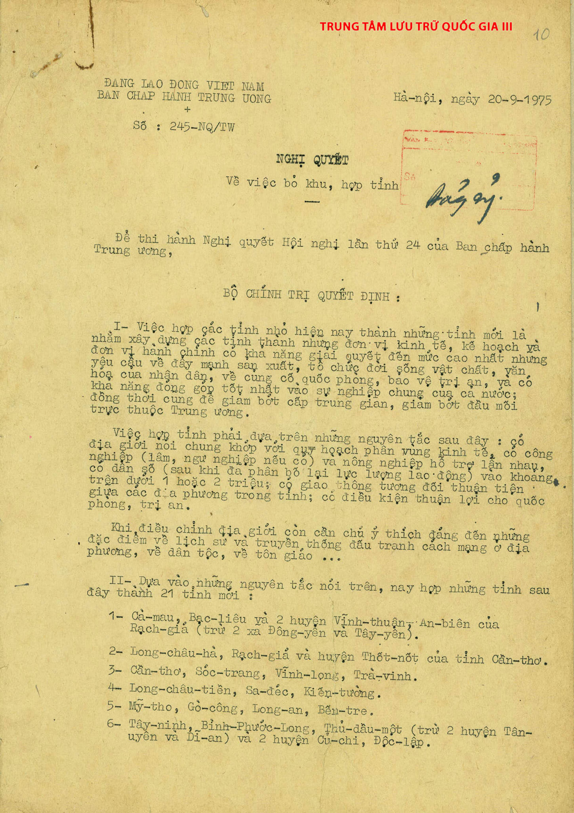
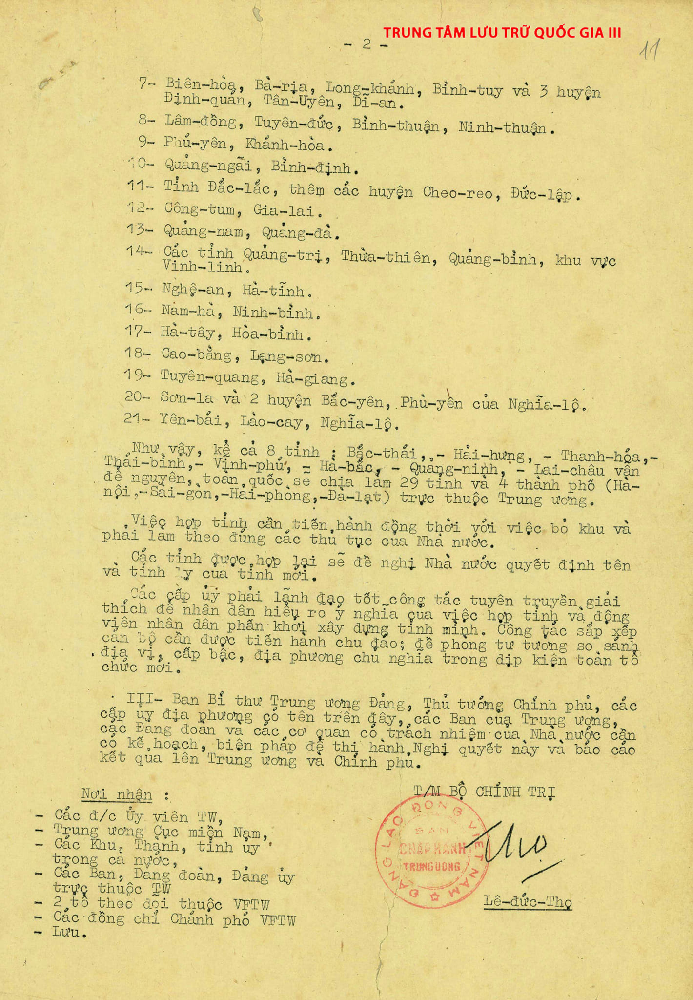

## Về series này

Đầu năm 2025, `"sáp nhập"` trở thành một từ khoá phổ biến trên các phương tiện truyền thông cũng như các công cụ tìm kiếm tại Việt Nam. Theo [Google trends](https://trends.google.com.vn/trends/explore?cat=16&date=2025-01-01%202025-12-31&geo=VN&q=s%C3%A1p%20nh%E1%BA%ADp&hl=en) ở thời điểm viết bài này (4/2025), các tìm kiếm liên quan đến `"sáp nhập"` khởi phát từ tất cả các tỉnh thành của Việt Nam, nhiều từ khoá còn phổ biến ở mức độ [`Breakout` (mức độ tìm kiếm đã tăng hơn 5000% so với trước đó – báo hiệu đang cực kỳ hot)](https://newsinitiative.withgoogle.com/resources/trainings/google-trends-understanding-the-data/).


  
  
  


Ngày 14 tháng 4 năm 2025, Thủ tướng chính phủ đã ban hành [Quyết định số `759/QĐ-TTg` về việc "Phê duyệt đề án sắp xếp, tổ chức lại đơn vị hành chính các cấp và xây dựng mô hình tổ chức chính quyền địa phương 02 cấp"](https://thuvienphapluat.vn/van-ban/Bo-may-hanh-chinh/Quyet-dinh-759-QD-TTg-2025-phe-duyet-De-an-sap-xep-to-chuc-lai-don-vi-hanh-chinh-cac-cap-651583.aspx#)(📎 [Tải về](759-qd-ttg.pdf)), với một nội dung quan trọng là tổ chức lại đơn vị hành chính cấp tỉnh thành từ 63 xuống chỉ còn 34 đơn vị, _giảm 29 đầu mối_. Tuy nhiên, trong lịch sử hiện đại, Việt Nam từng có một lần điều chỉnh tổ chức hành chính **có quy mô lớn hơn, giảm tới 34 đầu mối, bạn có biết không?**

Series này xuất phát từ nhu cầu cá nhân là ghi chép tổng hợp lại _lịch sử biến động của các đơn vị hành chính tại Việt Nam sau giải phóng_, từ đó đặt ra một số câu hỏi kỹ thuật liên quan đến việc tổ chức và lưu trữ dữ liệu hành chính sao cho có thể _truy xuất theo thời gian_, _phản ánh chính xác sự thay đổi_, và _thích ứng với các cải cách liên tục của thời đại_.

Một số câu hỏi và yêu cầu kỹ thuật mà loạt bài viết này hướng tới giải quyết, bao gồm:

- Vì sao các thay đổi về tổ chức đơn vị hành chính lại diễn ra?
- Các nguyên tắc và yếu tố quyết định việc phân cấp hành chính theo từng thời kỳ là gì?
- Có những phương pháp luận nào phổ biến trong việc tổ chức dữ liệu hành chính tại cấp quốc gia?
- Thiết kế dữ liệu như thế nào để có thể truy vết và phản ánh đúng mọi thay đổi qua các giai đoạn lịch sử?
- Minh hoạ kết quả mô hình hoá dữ liệu bằng giao diện tương tác ngay trong bài viết.

Bài viết mở đầu này tập trung vào việc tổng hợp lịch sử thay đổi lớn với đơn vị hành chính cấp tỉnh thành, nhằm đặt nền cho các phân tích dữ liệu lịch sử và thiết kế hệ thống lưu trữ hành chính trong các bài sau.

---

## Lịch sử biến động ĐVHC cấp tỉnh

### Tóm tắt nhanh

| Mốc năm | Thay đổi                                 | Số tỉnh thành |
|---------|-------------------------------------------|---------------|
| 1975    | Trước cải cách, giữ nguyên 72 tỉnh thành              | 72             |
| 1976    | Giảm mạnh sau thống nhất                 | 38            |
| 1978    | Tách Cao Bằng, Lạng Sơn                   | 39            |
| 1979    | Đặc khu Vũng Tàu – Côn Đảo                | 40            |
| 1989    | Tách Bình Trị Thiên, Phú Khánh, Nghĩa Bình thành 6 tỉnh mới| 44            |
| 1991    | Tách Vĩnh Phú, Hà Sơn Bình, Nghệ Tĩnh, Hải Hưng, Nam Hà…  | 53             |
| 1997    | Tách Hà Bắc, Bắc Thái, Nam Hà, thêm Bắc Ninh, Thái Nguyên…| 61             |
| 2004    | Tách Đắk Lắk, Cần Thơ, Lai Châu           | 64            |
| 2008    | Sáp nhập Hà Tây vào Hà Nội                | 63            |
| 2025    | Đề án sắp xếp, tổ chức lại đơn vị hành chính           | 34            |

<!-- ### Nay (2025) -->

### 1975

Sau giải phóng miền Nam, thống nhất đất nước 30/4/1975, cả nước có 72 đơn vị hành chính cấp tỉnh, trong đó ở miền Bắc có 28 tỉnh, thành phố và đặc khu, miền Nam có 44 tỉnh, thành phố.

|STT|Tỉnh|Miền|
|--|--|--|
|1|Cà Mau| Nam |
|2|Bạc Liêu| Nam |
|3|Hà Tiên| Nam |
|4|Long Xuyên| Nam |
|5|Tân An| Nam |
|6|Châu Đốc| Nam |
|7|Long Châu Hà| Nam |
|8|Rạch Giá| Nam |
|9|Cần Thơ| Nam |
|10|Sóc Trăng| Nam |
|11|Vĩnh Long| Nam |
|12|Trà Vinh| Nam |
|13|Long Châu Tiền| Nam |
|14|Sa Đéc| Nam |
|15|Kiến Tường| Nam |
|16|Mỹ Tho| Nam |
|17|Gò Công| Nam |
|18|Long An| Nam |
|19|Tây Ninh| Nam |
|20|Bến Tre| Nam |
|21|Bình Phước Long| Nam |
|22|Thủ Dầu Một| Nam |
|23|Biên Hoà| Nam |
|24|Bà Rịa| Nam |
|25|Long Khánh| Nam |
|26|Bình Tuy| Nam |
|27|Lâm Đồng| Nam |
|28|Tuyên Đức| Nam |
|29|Bình Thuận| Nam |
|30|Ninh Thuận| Nam |
|31|Phú Yên| Nam |
|32|Khánh Hoà| Nam |
|33|Quảng Ngãi| Nam |
|34|Bình Định| Nam |
|35|Đắc Lắc| Nam |
|36|Gia Lai| Nam |
|37|Kon Tum| Nam |
|38|Quảng Nam| Nam |
|39|Quảng Đà| Nam |
|40|Quảng Trị| Nam |
|41|Thừa Thiên| Nam |
|42|Gia Định| Nam |
|43|Chợ Lớn| Nam |
|44|Sài Gòn| Nam |
|45|Cao Bằng| Bắc |
|46|Lạng Sơn| Bắc |
|47|Hà Giang| Bắc |
|48|Tuyên Quang| Bắc |
|49|Yên Bái| Bắc |
|50|Lào Cai| Bắc |
|51|Nghĩa Lộ| Bắc |
|52|Sơn La| Bắc |
|53|Lai Châu| Bắc |
|54|Hoà Bình| Bắc |
|55|Hà Tây| Bắc |
|56|Vĩnh Phú| Bắc |
|57|Bắc Thái| Bắc |
|58|Hà Bắc| Bắc |
|59|Hải Hưng| Bắc |
|60|Nam Hà| Bắc |
|61|Ninh Bình| Bắc |
|62|Thanh Hoá| Bắc |
|63|Nghệ An| Bắc |
|64|Hà Tĩnh| Bắc |
|65|Quảng Bình| Bắc |
|66|Quảng Ninh| Bắc |
|67|Hải Phòng| Bắc |
|68|Thái Bình| Bắc |
|69|Hà Nội| Bắc |
|70|[Khu Vĩnh Linh](https://vi.wikipedia.org/wiki/%C4%90%E1%BA%B7c_khu_V%C4%A9nh_Linh)| Bắc |
|71|[Khu tự trị Việt Bắc](https://vi.wikipedia.org/wiki/Khu_t%E1%BB%B1_tr%E1%BB%8B_Vi%E1%BB%87t_B%E1%BA%AFc)| Bắc |
|72|[Khu tự trị Tây Bắc](https://vi.wikipedia.org/wiki/Khu_t%E1%BB%B1_tr%E1%BB%8B_T%C3%A2y_B%E1%BA%AFc)| Bắc |

Ngày 20/9/1975, Bộ Chính trị ban hành Nghị quyết số 245-NQTW về việc bỏ khu, hợp tỉnh nêu rõ: “Việc hợp các tỉnh nhỏ hiện nay thành những tỉnh mới là nhằm xây dựng các tỉnh thành những đơn vị kinh tế, kế hoạch và đơn vị hành chính có khả năng giải quyết đến mức cao nhất những yêu cầu về đẩy mạnh sản xuất, tổ chức đời sống vật chất, văn hóa của nhân dân, về củng cố quốc phòng, bảo vệ trị an và các khả năng đóng góp tốt nhất vào sự nghiệp chung của cả nước; đồng thời cũng để giảm bớt cấp trung gian, giảm bớt đầu mối trực thuộc Trung ương”.


  
  


 Kết quả sáp nhập là 33 tỉnh thành gồm 21 tỉnh mới (_chưa đặt tên_), 8 tỉnh giữ nguyên và 4 thành phố trực thuộc Trung ương.

| STT | Loại đơn vị                     | Thành phần cụ thể                                                                 |
|-----|----------------------------------|------------------------------------------------------------------------------------|
| 1   | Cụm sáp nhập                     | Tỉnh Cà Mau, tỉnh Bạc Liêu, và 2 huyện Vĩnh Thuận, An Biên (tỉnh Rạch Giá), trừ 2 xã Đông Yên và Tây Yên |
| 2   | Cụm sáp nhập                     | Tỉnh Long Châu Hà, tỉnh Rạch Giá, huyện Thốt Nốt (tỉnh Cần Thơ)                  |
| 3   | Cụm sáp nhập                     | Các tỉnh: Cần Thơ, Sóc Trăng, Vĩnh Long, Trà Vinh                                 |
| 4   | Cụm sáp nhập                     | Các tỉnh: Long Châu Tiền, Sa Đéc, Kiến Tường                                      |
| 5   | Cụm sáp nhập                     | Các tỉnh: Mỹ Tho, Gò Công, Long An, Bến Tre                                       |
| 6   | Cụm sáp nhập                     | Các tỉnh: Tây Ninh, Bình Phước Long, Thủ Dầu Một (trừ 2 huyện Tân Uyên, Dĩ An); cộng thêm huyện Củ Chi và huyện Độc Lập |
| 7   | Cụm sáp nhập                     | Các tỉnh: Biên Hòa, Bà Rịa, Long Khánh, Bình Tuy; và 3 huyện: Định Quán, Tân Uyên, Dĩ An |
| 8   | Cụm sáp nhập                     | Các tỉnh: Lâm Đồng, Tuyên Đức, Bình Thuận, Ninh Thuận                             |
| 9   | Cụm sáp nhập                     | Các tỉnh: Phú Yên, Khánh Hòa                                                      |
| 10  | Cụm sáp nhập                     | Các tỉnh: Quảng Ngãi, Bình Định                                                   |
| 11  | Cụm sáp nhập                     | Tỉnh Đắk Lắk; cộng thêm huyện Cheo Reo và huyện Đức Lập                           |
| 12  | Cụm sáp nhập                     | Các tỉnh: Kon Tum, Gia Lai                                                        |
| 13  | Cụm sáp nhập                     | Các tỉnh: Quảng Nam, Quảng Đà                                                     |
| 14  | Cụm sáp nhập                     | Các tỉnh: Quảng Trị, Thừa Thiên, Quảng Bình; cộng thêm khu vực Vĩnh Linh         |
| 15  | Cụm sáp nhập                     | Các tỉnh: Nghệ An, Hà Tĩnh                                                        |
| 16  | Cụm sáp nhập                     | Các tỉnh: Nam Hà, Ninh Bình                                                       |
| 17  | Cụm sáp nhập                     | Các tỉnh: Hà Tây, Hòa Bình                                                        |
| 18  | Cụm sáp nhập                     | Các tỉnh: Cao Bằng, Lạng Sơn                                                      |
| 19  | Cụm sáp nhập                     | Các tỉnh: Tuyên Quang, Hà Giang                                                   |
| 20  | Cụm sáp nhập                     | Tỉnh Sơn La và 2 huyện: Bắc Yên, Phù Yên (thuộc tỉnh Nghĩa Lộ)                    |
| 21  | Cụm sáp nhập                     | Các tỉnh: Yên Bái, Lào Cai, Nghĩa Lộ                                              |
| 22  | Tỉnh giữ nguyên                  | Bắc Thái                                                                          |
| 23  | Tỉnh giữ nguyên                  | Hải Hưng                                                                          |
| 24  | Tỉnh giữ nguyên                  | Thanh Hóa                                                                         |
| 25  | Tỉnh giữ nguyên                  | Thái Bình                                                                         |
| 26  | Tỉnh giữ nguyên                  | Vĩnh Phú                                                                          |
| 27  | Tỉnh giữ nguyên                  | Hà Bắc                                                                            |
| 28  | Tỉnh giữ nguyên                  | Quảng Ninh                                                                        |
| 29  | Tỉnh giữ nguyên                  | Lai Châu                                                                          |
| 30  | Thành phố trực thuộc Trung ương | Hà Nội                                                                            |
| 31  | Thành phố trực thuộc Trung ương | Sài Gòn                                                                           |
| 32  | Thành phố trực thuộc Trung ương | Hải Phòng                                                                         |
| 33  | Thành phố trực thuộc Trung ương | Đà Lạt                                                                            |

#### Tài liệu tham khảo

1. [Đề tài khoa học: Phân tích đánh giá công tác điều chỉnh địa giới hành chính trong những năm gần đây (1975 - 1992) - Lê Quang Thọ](./brief_24411_27866_29345.pdf)

https://vi.wikipedia.org/wiki/Ph%C3%A2n_c%E1%BA%A5p_h%C3%A0nh_ch%C3%ADnh_Vi%E1%BB%87t_Nam#Th%E1%BB%9Di_k%E1%BB%B3_1954_-_1975

https://archives.org.vn/gioi-thieu-tai-lieu-nghiep-vu/ky-iv-dia-gioi-hanh-chinh-viet-nam-tu-nam-1975-den-nay.htm

https://thuvienphapluat.vn/chinh-sach-phap-luat-moi/vn/ho-tro-phap-luat/tu-van-phap-luat/80341/chi-tiet-ban-do-hanh-chinh-viet-nam-nam-1976-voi-38-tinh-thanh

https://znews.vn/tu-72-tinh-thanh-nuoc-ta-giam-con-38-sau-sap-nhap-50-nam-truoc-post1537980.html

https://thuvienphapluat.vn/phap-luat/ho-tro-phap-luat/sap-nhap-con-33-tinh-thanh-viet-nam-tai-nghi-quyet-245nqtw-ngay-2091975-gom-nhung-dia-phuong-nao-206627.html
