
__Lời dẫn__


Google - đế chế Internet lớn nhất hành tinh, đã đi [một chặng đường dài](https://www.google.com/search/howsearchworks/our-history/) để phát triển từ một dự án nghiên cứu của hai nhà khoa học máy tính Larry Page và Sergei Brin đến cỗ máy tìm kiếm điều khiển hoạt động của nhân loại. Sẽ thật khó tưởng tượng cuộc sống của một công dân hiện đại sẽ ra sao nếu các sản phẩm đến từ hệ sinh thái của Google đột nhiên biến mất.

Với công cụ tìm kiếm của mình, từ lâu tên của đế chế Internet này đã trở thành một động từ chỉ hành động "tìm kiếm câu trả lời trên Internet". Dễ dàng bắt gặp ở bất cứ đâu cuộc nói chuyện kiểu:

> "Làm sao để hack được 4G Việt ten dùng tẹt nhỉ?" ~ "Dễ ẹc, google không tính phí!".

Tìm kiếm Google là thứ gần với ChatGPT nhất cho đến gần đây. Kể cả AI có bành trướng, tìm kiếm Google vẫn có chỗ đứng của riêng nó, và việc tìm kiếm sao cho đúng, đủ, nhanh vẫn luôn là kỹ năng mà bất cứ công dân số nào nên trang bị.


Lưu ý công cụ tìm kiếm Google thay đổi theo thời gian. Các tính năng trình bày trong bài viết này hoạt động ở thời điểm viết bài.


---

## Tính năng "Tìm kiếm nâng cao"

[Tìm kiếm nâng cao](https://www.google.com/advanced_search) cung cấp rất nhiều tham số tìm kiếm khác để chuốt lọc nhu cầu tìm kiếm của người dùng.

Truy cập Tìm kiếm nâng cao (TKNC) theo hình dưới đây.

Giao diện của tính năng TKNC chia làm 2 phần:

1. Cung cấp từ khoá hiệu quả
2. Thu gọn kết quả hiệu quả

Không hề ngẫu nhiên đây chính là hai nội dung đã được giới thiệu trong [phần 1 của series Sổ tay Gúc-thủ này](/blog/productivity/googling-basics/): _TKNC chính là giao diện người dùng (UI) cho các kỹ thuật xây dựng từ khóa trong ô tìm kiếm_. Ở nhóm "Thu gọn kết quả", người dùng còn có thể lọc theo:

- Ngôn ngữ.
- Quốc gia & vùng lãnh thổ.
- Theo khoảng thời gian (_một phần đã trình bày trong phần 1_).
- Theo tên miền (_bộ lọc `site:`, đã trình bày trong phần 1_).
- Theo loại file (_bộ lọc `filetype:`, đã trình bày trong phần 1_).
- Theo khu vực chứa từ khoá: địa chỉ web, tiêu đề, văn bản, liên kết trong thân bài (_đã trình bày trong phần 1_).
- Theo quyền sử dụng nội dung.

Phần tiếp ta xem xét các kỹ thuật tìm kiếm _không thông qua giao diện TKNC_ mà vẫn đạt được cùng hiệu quả.

## Tuỳ biến đường dẫn

Tuỳ biến tham số truy vấn đường dẫn (URL query param) là một cách nguy hiểm, hắc cơ kiểu kiểu vậy để thay đổi kết quả tìm kiếm. Mỗi tham số truy vấn (TSTV) là một cặp `key=value` được đặt sau dấu `?` trên địa chỉ của trang web. Chẳng hạn khi bạn tìm kiếm `"trái sầu riêng"` thì một yêu cầu với đường dẫn được gắn TSTV `q=trái+sầu+riêng` sẽ được gửi về Google để tra cứu và trả về kết quả.

Tư duy ngược một chút, nếu ta thay đổi tham số `q` và Enter thì cũng đạt được hiệu quả tìm kiếm tương tự như gõ vào ô tìm kiếm.


Dấu `+` thân thiện với địa chỉ web hơn là khoảng trắng. Đây chủ yếu là quy ước.
Mời đại chúng thử `q=măng+cụt`, `q=măng cụt`, `q=măng%20cụt` để so sánh.


Các kỹ thuật trong mục này sẽ tương tác với TSTV.


Truy vấn theo nhiều tham số được nối với nhau bởi dấu `&`.


### Lọc kết quả theo thời gian

Tên tham số: `as_qdr` với các giá trị khả dụng sau.

|Giá trị|Giải thích|
|--|--|
|`h`|Kết quả từ giờ trước đến nay|
|`d`|Kết quả từ ngày trước đến nay|
|`w`|Kết quả từ tuần trước đến nay|
|`m`|Kết quả của tháng trước đến nay|
|`y`|Kết quả của năm trước đến nay|

_Minh họa_.

- `as_qdr=h10`: 10 tiếng qua.
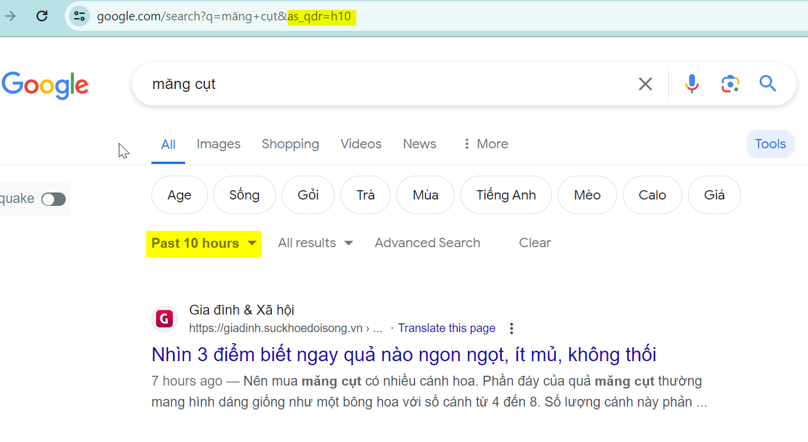

- `as_qdr=d`: 24h/1 ngày qua.
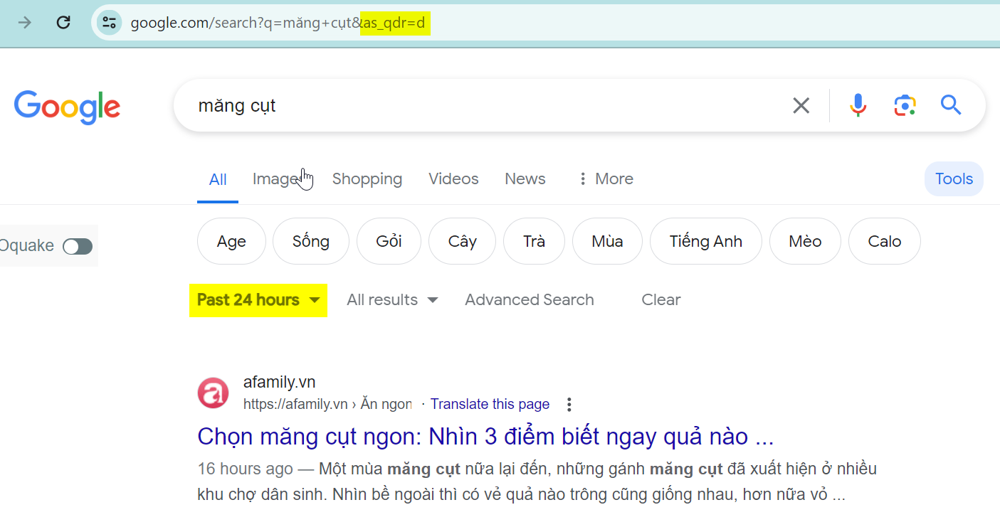

- `as_qdr=w2`: 2 tuần qua.
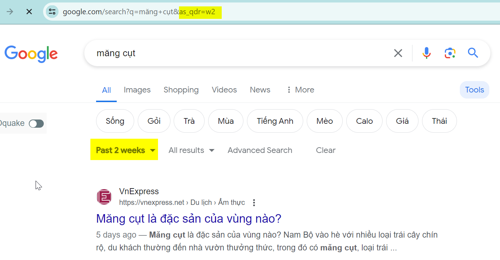

- `as_qdr=w2`: 10 năm qua.
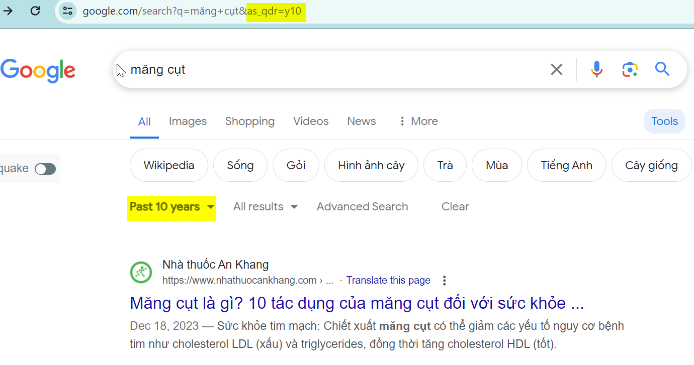

### Lọc kết quả theo ngôn ngữ

Tham số `lr` với các giá trị khả dụng sau.

|Giá trị|Ngôn ngữ|
|--|--|
|`lang_af`|Afrikaans|
|`lang_ar`|Arabic|
|`lang_hy`|Armenian|
|`lang_be`|Belarusian|
|`lang_bg`|Bulgarian|
|`lang_ca`|Catalan|
|`lang_zh-CN`|Chinese (Simplified)|
|`lang_zh-TW`|Chinese (Traditional)|
|`lang_hr`|Croatian|
|`lang_cs`|Czech|
|`lang_da`|Danish|
|`lang_nl`|Dutch|
|`lang_en`|English|
|`lang_eo`|Esperanto|
|`lang_et`|Estonian|
|`lang_tl`|Filipino|
|`lang_fi`|Finnish|
|`lang_fr`|French|
|`lang_de`|German|
|`lang_el`|Greek|
|`lang_iw`|Hebrew|
|`lang_hi`|Hindi|
|`lang_hu`|Hungarian|
|`lang_is`|Icelandic|
|`lang_id`|Indonesian|
|`lang_it`|Italian|
|`lang_ja`|Japanese|
|`lang_ko`|Korean|
|`lang_lv`|Latvian|
|`lang_lt`|Lithuanian|
|`lang_no`|Norwegian|
|`lang_fa`|Persian|
|`lang_pl`|Polish|
|`lang_pt`|Portuguese|
|`lang_ro`|Romanian|
|`lang_ru`|Russian|
|`lang_sr`|Serbian|
|`lang_sk`|Slovak|
|`lang_sl`|Slovenian|
|`lang_es`|Spanish|
|`lang_sw`|Swahili|
|`lang_sv`|Swedish|
|`lang_th`|Thai|
|`lang_tr`|Turkish|
|`lang_uk`|Ukrainian|
|`lang_vi`|Vietnamese|

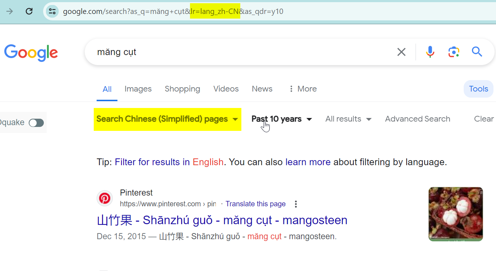

### Lọc kết quả theo quốc gia và vùng lãnh thổ


Chức năng này được hiểu theo nghĩa là lọc ra các kết quả có thể xem được từ quốc gia và vũng lãnh thổ được chọn.


Tham số `cr` với các giá trị khả dụng sau.

|Giá trị|Ngôn ngữ|
|--|--|
|`countryAF`|Afghanistan|
|`countryAL`|Albania|
|`countryDZ`|Algeria|
|`countryAS`|American Samoa|
|`countryAD`|Andorra|
|`countryAO`|Angola|
|`countryAI`|Anguilla|
|`countryAQ`|Antarctica|
|`countryAG`|Antigua & Barbuda|
|`countryAR`|Argentina|
|`countryAM`|Armenia|
|`countryAW`|Aruba|
|`countryAU`|Australia|
|`countryAT`|Austria|
|`countryAZ`|Azerbaijan|
|`countryBS`|Bahamas|
|`countryBH`|Bahrain|
|`countryBD`|Bangladesh|
|`countryBB`|Barbados|
|`countryBY`|Belarus|
|`countryBE`|Belgium|
|`countryBZ`|Belize|
|`countryBJ`|Benin|
|`countryBM`|Bermuda|
|`countryBT`|Bhutan|
|`countryBO`|Bolivia|
|`countryBA`|Bosnia & Herzegovina|
|`countryBW`|Botswana|
|`countryBV`|Bouvet Island|
|`countryBR`|Brazil|
|`countryIO`|British Indian Ocean Territory|
|`countryVG`|British Virgin Islands|
|`countryBN`|Brunei|
|`countryBG`|Bulgaria|
|`countryBF`|Burkina Faso|
|`countryBI`|Burundi|
|`countryKH`|Cambodia|
|`countryCM`|Cameroon|
|`countryCA`|Canada|
|`countryCV`|Cape Verde|
|`countryKY`|Cayman Islands|
|`countryCF`|Central African Republic|
|`countryTD`|Chad|
|`countryCL`|Chile|
|`countryCN`|China|
|`countryCX`|Christmas Island|
|`countryCC`|Cocos (Keeling) Islands|
|`countryCO`|Colombia|
|`countryKM`|Comoros|
|`countryCG`|Congo - Brazzaville|
|`countryCD`|Congo - Kinshasa|
|`countryCK`|Cook Islands|
|`countryCR`|Costa Rica|
|`countryCI`|Côte d’Ivoire|
|`countryHR`|Croatia|
|`countryCU`|Cuba|
|`countryCY`|Cyprus|
|`countryCZ`|Czechia|
|`countryDK`|Denmark|
|`countryDJ`|Djibouti|
|`countryDM`|Dominica|
|`countryDO`|Dominican Republic|
|`countryEC`|Ecuador|
|`countryEG`|Egypt|
|`countrySV`|El Salvador|
|`countryGQ`|Equatorial Guinea|
|`countryER`|Eritrea|
|`countryEE`|Estonia|
|`countrySZ`|Eswatini|
|`countryET`|Ethiopia|
|`countryFK`|Falkland Islands (Islas Malvinas)|
|`countryFO`|Faroe Islands|
|`countryFJ`|Fiji|
|`countryFI`|Finland|
|`countryFR`|France|
|`countryGF`|French Guiana|
|`countryPF`|French Polynesia|
|`countryTF`|French Southern Territories|
|`countryGA`|Gabon|
|`countryGM`|Gambia|
|`countryGE`|Georgia|
|`countryDE`|Germany|
|`countryGH`|Ghana|
|`countryGI`|Gibraltar|
|`countryGR`|Greece|
|`countryGL`|Greenland|
|`countryGD`|Grenada|
|`countryGP`|Guadeloupe|
|`countryGU`|Guam|
|`countryGT`|Guatemala|
|`countryGN`|Guinea|
|`countryGW`|Guinea-Bissau|
|`countryGY`|Guyana|
|`countryHT`|Haiti|
|`countryHM`|Heard & McDonald Islands|
|`countryHN`|Honduras|
|`countryHK`|Hong Kong|
|`countryHU`|Hungary|
|`countryIS`|Iceland|
|`countryIN`|India|
|`countryID`|Indonesia|
|`countryIR`|Iran|
|`countryIQ`|Iraq|
|`countryIE`|Ireland|
|`countryIL`|Israel|
|`countryIT`|Italy|
|`countryJM`|Jamaica|
|`countryJP`|Japan|
|`countryJO`|Jordan|
|`countryKZ`|Kazakhstan|
|`countryKE`|Kenya|
|`countryKI`|Kiribati|
|`countryKW`|Kuwait|
|`countryKG`|Kyrgyzstan|
|`countryLA`|Laos|
|`countryLV`|Latvia|
|`countryLB`|Lebanon|
|`countryLS`|Lesotho|
|`countryLR`|Liberia|
|`countryLY`|Libya|
|`countryLI`|Liechtenstein|
|`countryLT`|Lithuania|
|`countryLU`|Luxembourg|
|`countryMO`|Macao|
|`countryMG`|Madagascar|
|`countryMW`|Malawi|
|`countryMY`|Malaysia|
|`countryMV`|Maldives|
|`countryML`|Mali|
|`countryMT`|Malta|
|`countryMH`|Marshall Islands|
|`countryMQ`|Martinique|
|`countryMR`|Mauritania|
|`countryMU`|Mauritius|
|`countryYT`|Mayotte|
|`countryMX`|Mexico|
|`countryFM`|Micronesia|
|`countryMD`|Moldova|
|`countryMC`|Monaco|
|`countryMN`|Mongolia|
|`countryMS`|Montserrat|
|`countryMA`|Morocco|
|`countryMZ`|Mozambique|
|`countryMM`|Myanmar (Burma)|
|`countryNA`|Namibia|
|`countryNR`|Nauru|
|`countryNP`|Nepal|
|`countryNL`|Netherlands|
|`countryNC`|New Caledonia|
|`countryNZ`|New Zealand|
|`countryNI`|Nicaragua|
|`countryNE`|Niger|
|`countryNG`|Nigeria|
|`countryNU`|Niue|
|`countryNF`|Norfolk Island|
|`countryKP`|North Korea|
|`countryMK`|North Macedonia|
|`countryMP`|Northern Mariana Islands|
|`countryNO`|Norway|
|`countryOM`|Oman|
|`countryPK`|Pakistan|
|`countryPW`|Palau|
|`countryPS`|Palestine|
|`countryPA`|Panama|
|`countryPG`|Papua New Guinea|
|`countryPY`|Paraguay|
|`countryPE`|Peru|
|`countryPH`|Philippines|
|`countryPN`|Pitcairn Islands|
|`countryPL`|Poland|
|`countryPT`|Portugal|
|`countryPR`|Puerto Rico|
|`countryQA`|Qatar|
|`countryRE`|Réunion|
|`countryRO`|Romania|
|`countryRU`|Russia|
|`countryRW`|Rwanda|
|`countryWS`|Samoa|
|`countrySM`|San Marino|
|`countryST`|São Tomé & Príncipe|
|`countrySA`|Saudi Arabia|
|`countrySN`|Senegal|
|`countryRS`|Serbia|
|`countrySC`|Seychelles|
|`countrySL`|Sierra Leone|
|`countrySG`|Singapore|
|`countrySK`|Slovakia|
|`countrySI`|Slovenia|
|`countrySB`|Solomon Islands|
|`countrySO`|Somalia|
|`countryZA`|South Africa|
|`countryGS`|South Georgia & South Sandwich Islands|
|`countryKR`|South Korea|
|`countryES`|Spain|
|`countryLK`|Sri Lanka|
|`countrySH`|St. Helena|
|`countryKN`|St. Kitts & Nevis|
|`countryLC`|St. Lucia|
|`countryPM`|St. Pierre & Miquelon|
|`countryVC`|St. Vincent & Grenadines|
|`countrySD`|Sudan|
|`countrySR`|Suriname|
|`countrySJ`|Svalbard & Jan Mayen|
|`countrySE`|Sweden|
|`countryCH`|Switzerland|
|`countrySY`|Syria|
|`countryTW`|Taiwan|
|`countryTJ`|Tajikistan|
|`countryTZ`|Tanzania|
|`countryTH`|Thailand|
|`countryTG`|Togo|
|`countryTK`|Tokelau|
|`countryTO`|Tonga|
|`countryTT`|Trinidad & Tobago|
|`countryTN`|Tunisia|
|`countryTR`|Türkiye|
|`countryTM`|Turkmenistan|
|`countryTC`|Turks & Caicos Islands|
|`countryTV`|Tuvalu|
|`countryUM`|U.S. Outlying Islands|
|`countryVI`|U.S. Virgin Islands|
|`countryUG`|Uganda|
|`countryUA`|Ukraine|
|`countryAE`|United Arab Emirates|
|`countryGB`|United Kingdom|
|`countryUS`|United States|
|`countryUY`|Uruguay|
|`countryUZ`|Uzbekistan|
|`countryVU`|Vanuatu|
|`countryVA`|Vatican City|
|`countryVE`|Venezuela|
|`countryVN`|Vietnam|
|`countryWF`|Wallis & Futuna|
|`countryEH`|Western Sahara|
|`countryYE`|Yemen|
|`countryZM`|Zambia|
|`countryZW`|Zimbabwe|

## Tiện ích

### Thời tiết

- `weather:ho chi minh`: tra thời tiết tại Hồ Chí Minh, có thể yêu cầu mở app thời tiết tương ứng trên từng OS.

### Tra từ

- `define:delicacy`: trả về định nghĩa của từ `delicacy` từ các trang từ điển.

### Bản đồ

- `map:hanoi`: xem Hanoi trên bản đồ, có thể yêu cầu mở app bản đồ tương ứng trên từng OS.

### Đổi đơn vị


Tìm kiếm Google cung cấp công cụ chuyển đổi đơn vị thông qua từ khoá: __`Unit Converter`__.

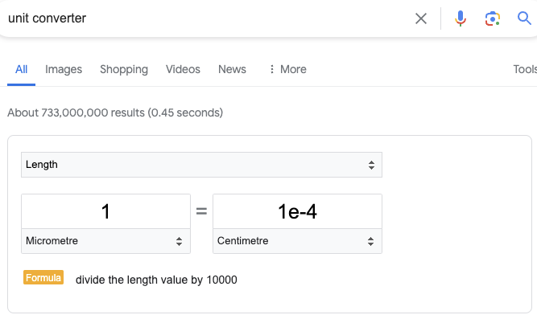


Nếu không muốn mất thêm một bước gọi công cụ, sử dụng từ khoá `in` có thể đổi đơn vị ngay.

- `$200 in vnd`
- `1.45m in feet`

### Máy tính


Tìm kiếm Google cung cấp công cụ máy tính thông qua từ khoá: __`Calculator`__.

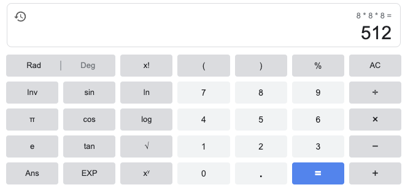




Công cụ Máy tính hoạt động hiệu quả nhất với từ khoá bằng tiếng Anh. Đại chúng nên giắt lưng các thuật ngữ toán học trong thứ tiếng thượng đẳng này.


#### Biểu thức đại số

- `5**5`: tương đương `5^5` nghĩa là `5 luỹ thừa 5`.
- `x^2+6-2=0`: kết quả rất ảo, đại chúng hãy thử.

Máy tính Google hỗ trợ các toán tử nào? Vui lòng xem lại ảnh bên trên hoặc thực hành mở ngay Google.

#### Đồ thị

Google có thể vẽ các loại đồ thị sau:

- Hàm lượng giác.
- Hàm mũ.
- Hàm loga.
- Đồ thị 3 chiều (Yêu cầu trình duyệt hỗ trợ [WebGL](https://developer.mozilla.org/en-US/docs/Web/API/WebGL_API#browser_compatibility)).

Để vẽ đồng thời nhiều đồ thị, nhập phương trình phân cách nhau bởi dấu `,`. Đồ thị kết quả có thể tương tác được (zoom, pan, hiển thị điểm dữ liệu...).

#### Hình học

- Các hình dạng hỗ trợ: Các hình cong hai chiều và ba chiều, các khối đa diện đều, đa giác, lăng trụ, kim tự tháp, tứ giác và tam giác.
- Các công thức và phương trình hỗ trợ: Diện tích, chu vi, định luật sin và cosin, cạnh huyền, chu vi, định lý Pythagoras (Pi-ta-go), diện tích bề mặt, và thể tích.

_Ví dụ_.

- Tìm đường kính hình cầu có thể tích theo gallon: `find the diameter of a sphere whose volume is 524 gallons`
- Chu vi tam giác: `perimeter of triangle`
- Diện tích hình tròn: `area of circle`
- Thể tích hình trụ: `volume of cylinder`
- Tính cạnh huyền theo Pythagoras: `a^2+b^2=c^2 calc a=4 b=7 c=?`


  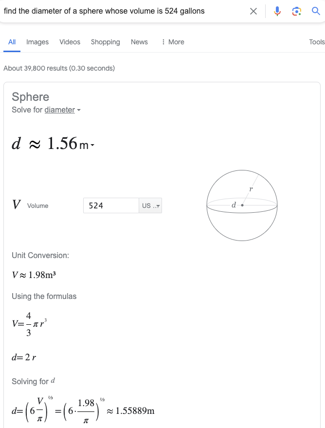
  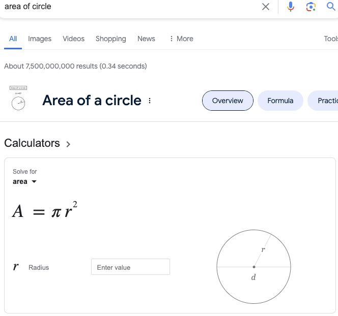
  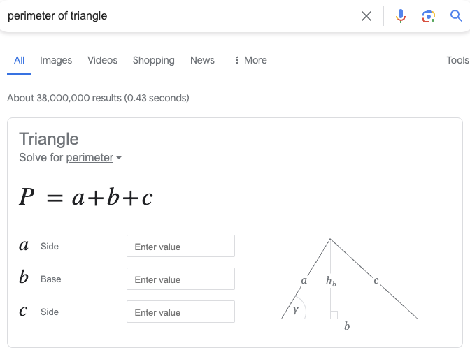
  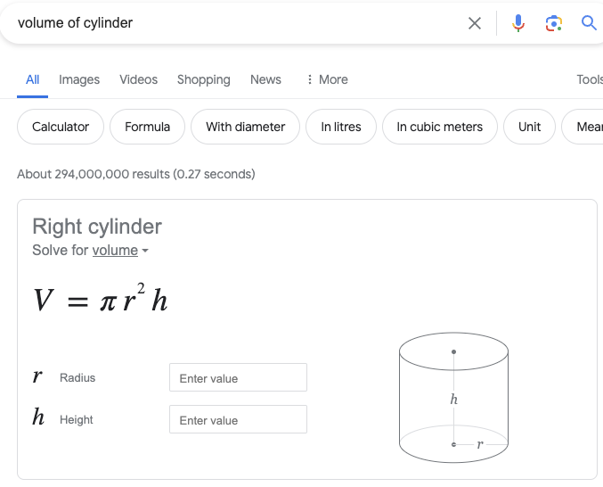
  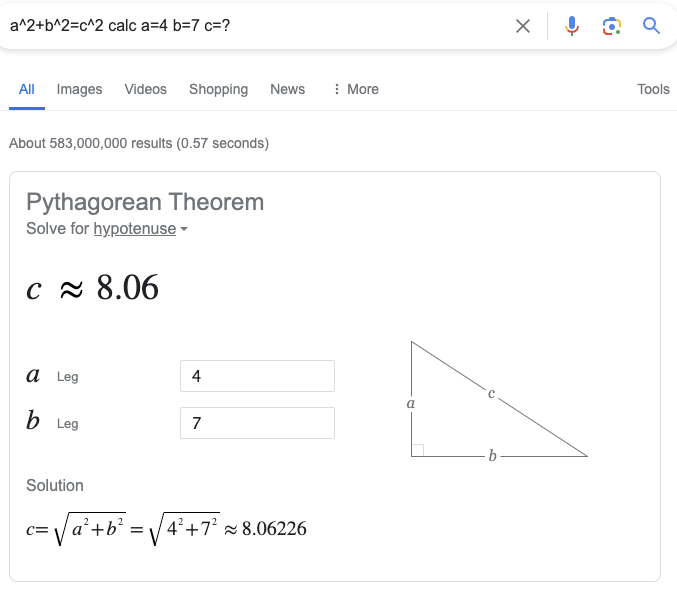


### Tìm màu


Tìm kiếm Google cung cấp công cụ bảng màu thông qua từ khoá: __`Color Picker`__.

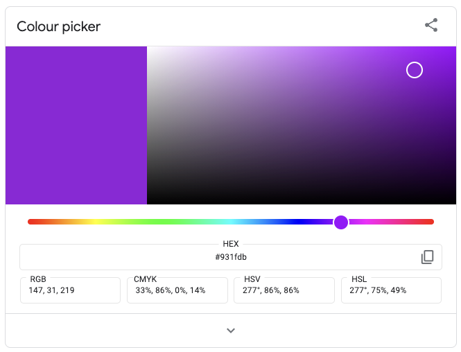


Người dùng có thể chuyển đổi mã màu từ các định dạng:

- Hex
- RGB
- Pantone

sang các định dạng

- Hex
- RGB
- HSV
- HSL
- CMYK

Người dùng có thể tìm màu theo từ khoá:

- `rgb (255, 255, 255)`
- `rgb 255 255 255`
- `#f0f0f0`
- `color f0f0f0`
- `pantone 214 u`
- `pms 200 c`

## Tài liệu tham khảo

- [Google advanced search](https://www.google.com/advanced_search)
- [[Google Support] Manage calculator, unit converter & color codes](https://support.google.com/websearch/answer/3284611)
