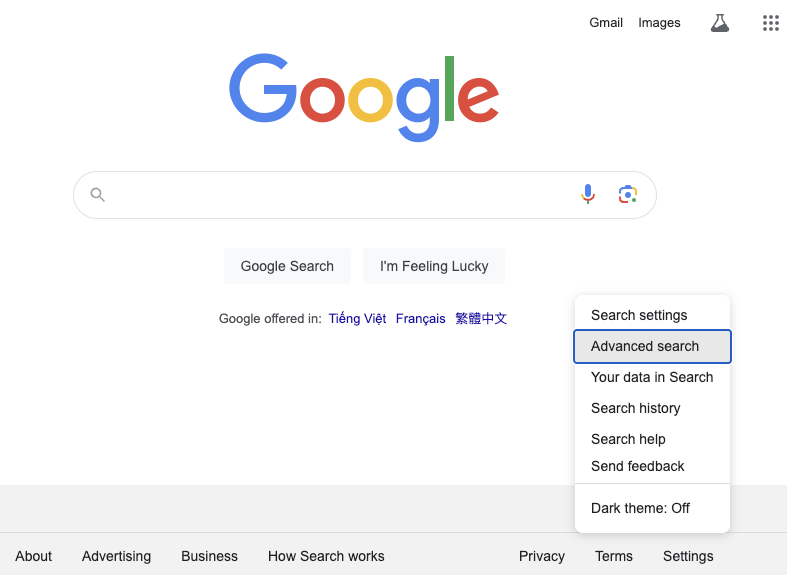
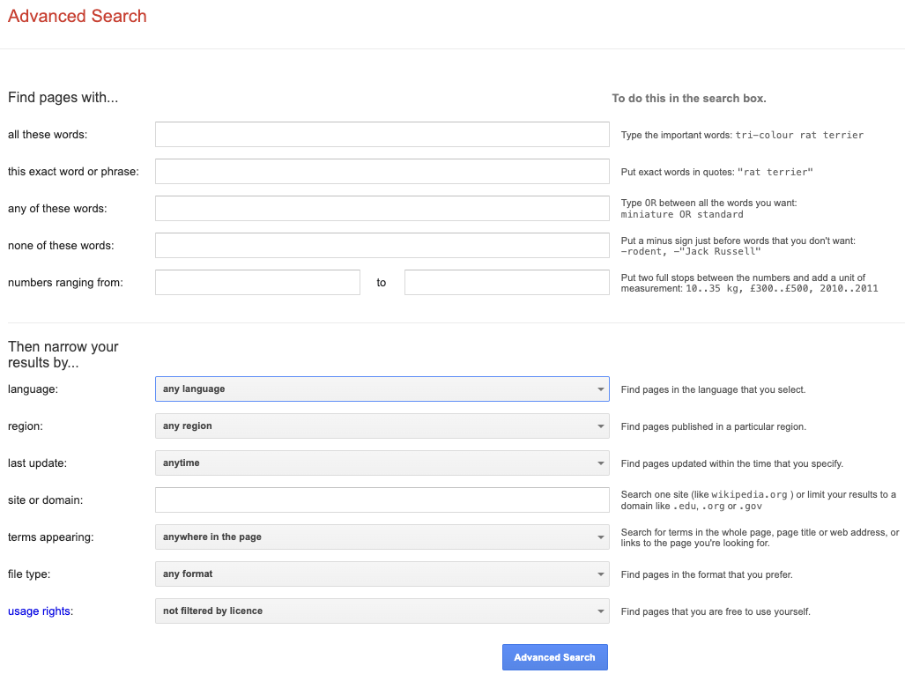

Google - đế chế Internet lớn nhất hành tinh, đã đi [một chặng đường dài](https://www.google.com/search/howsearchworks/our-history/) để phát triển từ một dự án nghiên cứu của hai nhà khoa học máy tính Larry Page và Sergei Brin đến cỗ máy tìm kiếm điều khiển hoạt động của nhân loại. Sẽ thật khó tưởng tượng cuộc sống của một công dân hiện đại sẽ ra sao nếu các sản phẩm đến từ hệ sinh thái của Google đột nhiên biến mất.

Với công cụ tìm kiếm của mình, từ lâu tên của đế chế Internet này đã trở thành một động từ chỉ hành động "tìm kiếm câu trả lời trên Internet". Dễ dàng bắt gặp ở bất cứ đâu cuộc nói chuyện kiểu:

> "Làm sao để hack được 4G Việt ten dùng tẹt nhỉ?" ~ "Dễ ẹc, google không tính phí!".

Tìm kiếm Google là thứ gần với ChatGPT nhất cho đến gần đây. Kể cả AI có bành trướng, tìm kiếm Google vẫn có chỗ đứng của riêng nó, và việc tìm kiếm sao cho đúng, đủ, nhanh vẫn luôn là kỹ năng mà bất cứ công dân số nào nên trang bị.

Lưu ý công cụ tìm kiếm Google thay đổi theo thời gian. Các tính năng trình bày trong bài viết này hoạt động ở thời điểm viết bài.

## Tính năng "Tìm kiếm nâng cao"

[Tìm kiếm nâng cao](https://www.google.com/advanced_search) cung cấp rất nhiều tham số tìm kiếm khác để chuốt lọc nhu cầu tìm kiếm của người dùng.

Truy cập tìm kiếm nâng cao theo hình dưới đây cho ai chưa biết.

Giao diện người dùng của tính năng tìm kiếm nâng cao chia làm 2 phần ứng với 2 bước trong hoạt động tìm kiếm:

1. Cung cấp từ khoá hiệu quả
2. Thu gọn kết quả hiệu quả

Nhiều kỹ thuật của "Tìm kiếm nâng cao" có thể đạt được ngay bằng cách nhập từ khoá theo cú pháp chuyên dụng, sẽ được nêu rõ dưới đây.

## Cung cấp từ khoá hiệu quả

### Không cần viết hoa

Mặc định, Google không phân biệt hoa thường.

### Chỉ nhập từ quan trọng

- Tập trung vào từ mang thông tin
- Tìm từ đồng nghĩa ngắn gọn
- Bỏ qua mạo từ, trạng từ, túc từ, đại từ, giới từ không mang tin

Bởi đó cũng là cách Google trích rút thông tin trong từ khoá nhận được.

❌ `cách cài đặt windows trên máy tính macbook`

✅ `cài windows trên macbook`

### Phải chứa cụm từ

Bỏ cụm từ vào dấu nháy kép `""`.

- `phần mềm chỉnh sửa ảnh "windows 11"`

### A hoặc B (`OR`)

Dùng toán tử `OR` (phải viết hoa) hoặc `|`.

- `climate change OR global warming`
- `jobs | gates`

### A và B (`AND`)

Dùng toán tử `AND` (phải viết hoa) hoặc `&`.

- `jobs AND gates`
- `climate change & global warming`

### Khớp bất kỳ (`*`)

- `david * liverpool`
- `nguyễn sinh * nghệ an`

### Không chứa cụm từ

Đặt dấu trừ `-` ngay trước từ muốn loại ra. Với cụm từ nhớ sử dụng dấu nháy kép.

- `loài gặm nhấm -chuột`
- `nhạc trẻ hay -"hồ quang hiếu"`

### Gom nhóm

- `(tủ lạnh OR máy giặt) samsung`

có thể xem như tương đương

- `tủ lạnh samsung OR máy giặt samsung`

### Có khoảng số

Sử dụng hai dấu chấm liên tiếp `..`.

- `sơ mi 100k..300k`
- `quần 160..170 cm`
- `gà 1..3 kg`

## Thu gọn kết quả hiệu quả

### Chỉ hiện kết quả ở trang Z

Sử dụng bộ lọc `site:` với giá trị có thể là tên miền đầy đủ hoặc đuôi tên miền.

- `explain like im 5 site:reddit.com`
- `css tools site:dev.to`
- `site:gov "George Washington"`
- `site:co.uk tech`
- `site:lifewire.com OR site:nasa.gov "electric vehicles"`

Lưu ý sau bộ lọc `site:` không có dấu cách.

❌ `center a div site: stackoverflow.com`

✅ `center a div site:stackoverflow.com`

### Lọc kết quả là file

Dùng bộ lọc `filetype:` hoặc `ext:`.

Tìm tài liệu PDF về xác suất thống kê.

- `xác suất thống kê filetype:pdf`

### Lọc kết quả theo khoảng thời gian

- `gia vang before:2010`
- `ngo bao chau after:2016`
- `covid after:2020 before:2022`

### Lọc kết quả có từ khoá trong…

#### URL

- `inurl:apple`: chứa một từ khoá trong đường dẫn.
- `allinurl:apple iphone`: chứa nhiều từ khoá trong URL.

#### Tiêu đề

Tiêu đề thường là nội dung `title` hoặc `h1` trong HTML.

- `intitle:apple`: chứa một từ khoá trong tiêu đề.
- `allintitle:apple iphone`: chứa nhiều từ khoá trong tiêu đề.

#### Thân bài

- `intext:apple`: chứa một từ khoá trong văn bản thân bài.
- `allintext:apple iphone`: chứa nhiều từ khoá trong văn bản thân bài.

## Kỹ thuật hay ho khác

### Thời tiết

- `weather:ho chi minh`: tra thời tiết tại Hồ Chí Minh, có thể yêu cầu mở app thời tiết tương ứng trên từng OS.

### Tra từ

- `define:delicacy`: trả về định nghĩa của từ `delicacy` từ các trang từ điển.

### Bản đồ

- `map:hanoi`: xem Hanoi trên bản đồ, có thể yêu cầu mở app bản đồ tương ứng trên từng OS.

### Đổi đơn vị

Sử dụng từ khoá `in` có thể đổi đơn vị ngay.

- `$200 in vnd`
- `1.45m in feet`

### Máy tính

Gõ biểu thức trực tiếp lên thanh tìm kiếm.

- `5**5`
- `x^2+6-2=0`: tính được `x` luôn nha, ghê không.

## Tài liệu tham khảo

- [[Ahrefs] Google advanced search operators](https://ahrefs.com/blog/google-advanced-search-operators/)
- [[GoogleGuide] Sharpening queries](https://www.googleguide.com/sharpening_queries.html)
- [[Google blog] Refine Google searches](https://support.google.com/websearch/answer/2466433)
