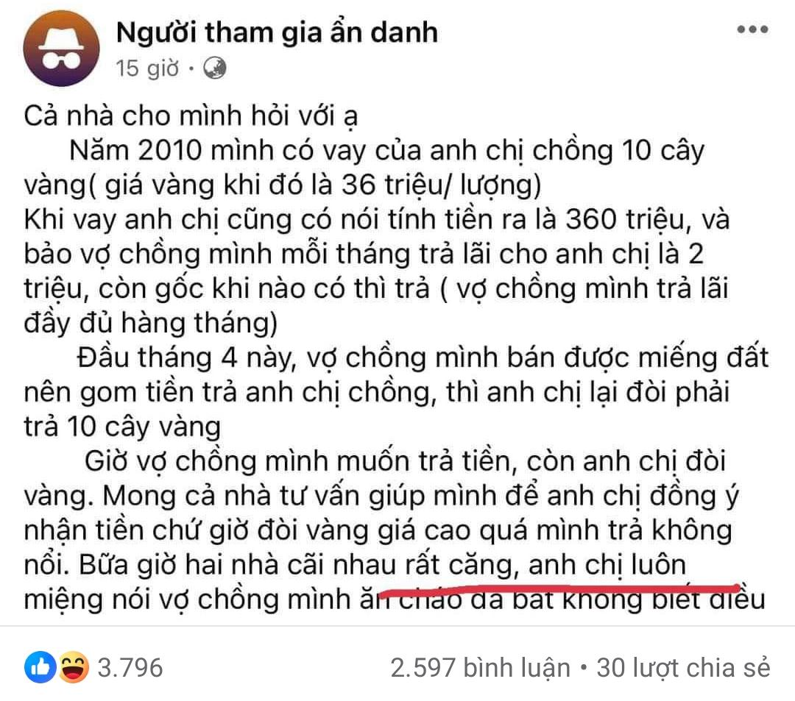

## Lời tiên tri tự ứng nghiệm là gì?

Lời tiên tri tự ứng nghiệm (Self-fulfilling prophecy - SFP) xảy ra khi một dự đoán trở thành sự thật bởi một niềm tin, một kỳ vọng cao rằng dự đoán đó sẽ trở thành sự thật. _Nói cách khác, một niềm tin, một kỳ vọng cao có thể điều chỉnh hành vi của con người để hiện thực hóa theo hướng củng cố cho niềm tin, kỳ vọng đó_.


__Câu chuyện #1.__

Dekisugi chuẩn bị đi phỏng vấn với một công ty lớn với niềm tin rằng công việc này sinh ra là dành cho mình. Với niềm tin đó, anh ta đặt quyết tâm cao, ôn tập chăm chỉ. Ngày lên ghế nóng, anh ta trả lời phỏng vấn đầy tự tin. Kết quả là anh ta trúng tuyển đúng như kỳ vọng ban đầu.



__Câu chuyện #2.__

Nobita bước ra khỏi nhà bằng chân trái. Vốn đồng bóng từ nhỏ, cậu vừa đi đến trường vừa nơm nớp lo sợ ngày hôm đó sẽ gặp xui xẻo. Cậu làm bài kiểm tra không tốt khi đọc sai đề bài và nhận điểm kém. Trên đường về nhà, do mải nghĩ cách trả lời mẹ về bài kiểm tra, cậu bị trượt vỏ lon té sấp mặt. Nobita tin mình sẽ gặp xui xẻo và cậu ta đã gặp xui xẻo.



__Câu chuyện #3.__

Adam và Eve bắt đầu hẹn hò. Adam cảm giác Eve "không hợp mình lắm", nên không thực sự nghiêm túc: không trả lời tin nhắn, không chủ động hẹn gặp. Eve không mất nhiều thời gian để nhận ra, giảm dần hứng thú, và đường dây liên lạc dần đứt. Adam sau đó nghĩ rằng cảm giác của mình đã đúng từ đầu.



__Câu chuyện #4.__

Một câu chuyện có thật theo tinh thần "Fake it till you make it".

Ở tuổi 19, [Elizabeth Holmes](https://en.wikipedia.org/wiki/Elizabeth_Holmes) bỏ ngang Đại học Stanford để khởi nghiệp [công ty công nghệ Theranos](https://www.wikiwand.com/en/Theranos) tại thung lũng Silicon. Năm 2013, sau 10 năm hoạt động nghiên cứu ở chế độ ẩn (stealth mode), giới khoa học sửng sốt khi Theranos công bố công nghệ cho phép sàng lọc hơn 200 chỉ số sức khỏe chỉ bằng một vài giọt máu từ đầu ngón tay. Nhưng chẳng bao lâu sau, các công bố này bị cáo buộc là sai sự thật. Holmes bị tuyên án 11 năm 3 tháng tù vì tội lừa đảo vào năm 2022.

Từng được truyền thông tung hô là "Steve Jobs mới", cô gái trẻ tài năng đã qua mặt những bộ óc (tự xưng là!?) thông minh nhất thung lũng Silicon để gọi vốn được tổng cộng hơn 700 triệu đô Mỹ. Ở đỉnh cao, Theranos được định giá 10 tỷ đô. Năm 2015, khi 31 tuổi, Holmes được Forbes vinh danh là nữ tỷ phú tự thân trẻ nhất và giàu nhất nước Mỹ. Gây dựng nên khối tài sản kếch xù dựa trên một công nghệ ngụy tạo, niềm tin của cô gái này vào bản thân cũng như lan tỏa ra xung quanh thực sự phi thường. _Đúng là nói hay vẫn dễ vinh danh hơn làm hay, thưa đại chúng_.


## SFP hoạt động thế nào?

SFP là một chu trình lặp lại với 4 bậc:

1. Chúng ta hình thành một niềm tin, một kỳ vọng về một thành quả tương lai. Thành quả có thể về bản thân (ví dụ, "Tôi sẽ đậu đại học") hoặc môi trường (ví dụ, "Đồng nghiệp không thích tôi").
1. Niềm tin này ảnh hưởng đến thái độ của bản thân với tình huống (ví dụ, học hành chăm chỉ) hoặc với môi trường (ví dụ, hạn chế tiếp xúc với đồng nghiệp).
1. Thái độ và hành động của ta hình thành nên cách nhìn của môi trường tới ta, thể hiện bằng hành vi từ người khác (ví dụ, đồng nghiệp cũng né tránh ta) hoặc kết quả nhận lại (ví dụ, đậu đại học).
1. Niềm tin ban đầu là chính xác, hành vi theo đó được củng cố, và lời tiên tri đã ứng nghiệm.

## Phân loại SFP

Dựa trên chủ thể của niềm tin điều khiển hành vi, SFP chia làm hai loại chính:

1. Tiên tri tự thân (Self-imposed prophecies) dựa trên kỳ vọng của bản thân.
2. Tiên tri ngoại lai (Other-imposed prophecies) dựa trên kỳ vọng của môi trường xung quanh.

### Tiên tri tự thân


stateDiagram-v2
  state "😊 Niềm tin" as B
  state "💯 Kỳ vọng" as E
  state "💪 Hành động" as A
  state "💯 Kết quả" as R
  B --> E: Tác động
  E --> A: Tác động
  A --> R: Tác động
  R --> B: Củng cố


#### Hiệu ứng giả dược

Để đánh giá hiệu quả của một dược phẩm mới, các thử nghiệm lâm sàng được áp dụng trên hai nhóm bệnh nhân: một có kiểm soát (control group) và một thực điều trị (treatment group). Người tham gia không biết mình thuộc nhóm nào.

Nhóm điều trị được sử dụng thuốc thật, trong khi nhóm kiểm soát được cung cấp loại chế phẩm có ngoại hình rất giống hàng thật nhưng không có bất cứ đặc tính điều trị nào (_giả dược_ - [placebo](https://www.betterhealth.vic.gov.au/health/conditionsandtreatments/placebo-effect) - dân dược hay đọc là _"Pờ-la-xê-bô"_ thì phải!). Nhà nghiên cứu so sánh kết quả giữa hai nhóm để đánh giá hiệu quả thuốc.

Điều thú vị là trong một số trường hợp, _bệnh nhân dùng giả dược lại phản ánh chuyển biến tích cực_. Các nhà nghiên cứu đánh giá điều này xuất phát từ niềm tin của bệnh nhân rằng họ được điều trị thật. Hiện tượng này được gọi là [hiệu ứng giả dược (The placebo effect)](https://www.scribbr.com/research-bias/placebo-effect/).

### Tiên tri ngoại lai


stateDiagram-v2
  state "🗣️ Hành động từ mình tới mọi người" as SA
  state "👨‍👩‍👧‍👦 Niềm tin của mọi người về mình" as OB
  state "📢 Hành động từ mọi người tới mình" as OA
  state "👤 Niềm tin vào bản thân mình" as SB
  SA --> OB: Tác động
  OB --> OA: Điều chỉnh
  OA --> SB: Củng cố
  SB --> SA: Tác động


#### Hiệu ứng Pygmalion

Trong một nghiên cứu giáo dục về mối liên hệ giữa kỳ vọng của giáo viên với kết quả của học sinh, sau khi tổ chức một bài kiểm tra ở đầu học kỳ, giáo viên được chỉ định một số học sinh được đánh giá là có tiềm năng trở nên xuất sắc nếu được kèm cặp kỹ càng. Thật ra, những học sinh này được _lựa chọn ngẫu nhiên_.

Sau vài tháng, các nhà nghiên cứu quay lại và kiểm tra, nhận được kết quả là nhóm học sinh được định vị là "tiềm năng" học hành tiến bộ nhanh hơn bạn cùng lớp. Nguyên nhân là vì được kỳ vọng sẽ trở nên giỏi giang nên giáo viên đối xử với nhóm này khác biệt so với phần còn lại, chẳng hạn như dành nhiều công sức và thời gian chỉ dạy hơn. Điều này không chỉ tác động đến lực học mà còn nâng cao vị thế tâm lý của mỗi học sinh thuộc nhóm này khi tự nhìn nhận bản thân.

Chúng ta (giáo viên trong nghiên cứu trên) dành cho người khác (nhóm học sinh tiềm năng trong nghiên cứu trên) niềm tin thế nào sẽ tác động tới cách ta hành xử với họ theo hướng đưa đẩy đến điều ta tin thành sự thật. Hiện tượng này được gọi là [hiệu ứng Pygmalion](https://www.scribbr.com/research-bias/pygmalion-effect/): ai đó được kỳ vọng cao hơn dễ tạo ra kết quả tốt hơn.



#### Hiệu ứng Golem

Hiệu ứng Pygmalion là một minh chứng thú vị cho tác động của môi trường lên quá trình hình thành tính cách, phẩm chất của cá nhân. Các cụ ta đã chiêm nghiệm "Ở bầu thì tròn, ở ống thì dài", có thể hiểu với hai chiều ý nghĩa:

- Môi trường là khuôn ép "tạo hình" hành vi cho mỗi cá thể.
- Mỗi cá thể có khuynh hướng hành xử thích nghi theo cái khuôn bao quanh.

Một "hiệu ứng Pygmalion ngược" vì thế có thể được phát biểu rằng: kỳ vọng thấp kém lên một ai đó có thể khiến kết quả tồi trở thành sự thật.


Liếc nhanh lên trang vở ô li mà cậu bé Nobita đang nguệch ngoạc, anh thầy giáo trẻ chẹp miệng: "Nét chữ nết người, viết như gà bới như này thì làm được trò trống gì hả em!". Cô bé ngồi cạnh che miệng cười khẽ. Hai cậu bạn Xeko mỏ nhọn và Chaien cục súc thì không dè dặt gì, cười phá lên để bắt nhịp cho cả lớp hưởng ứng. Nobita bối rối, ủ dột và tự ti. Cậu không bao giờ đạt được kết quả học tập tốt trong suốt bậc tiểu học.


Hiện tượng này được gọi là [hiệu ứng Golem](https://en.wikipedia.org/wiki/Golem_effect), đặt tên theo một truyền thuyết của người Do Thái. Hiệu ứng này đại diện cho các tác động tiêu cực của lời tiên tri tự ứng nghiệm xuất phát từ môi trường.


Theo truyền thuyết, [Golem](https://en.wikipedia.org/wiki/Golem) là một sinh vật bằng đất nung được tạo ra để bảo vệ người Do Thái ở Prague trước những xung đột thánh chiến. Tuy vậy, Golem càng lớn càng hung hãn và bạo liệt, và cuối cùng buộc phải bị tiêu diệt.



#### Sự thao túng của truyền thông

Hệ thống truyền thông, bao gồm báo chí và mạng xã hội, có quyền lực lớn điều khiển hành vi của cả một cộng đồng. Vì thế, các trùm truyền thống dễ dàng vận dụng SFP để điều khiển xã hội.

- Một cô "hot girl mà chẳng ai biết đến" ngồi chễm chệ ở bài tiêu điểm của một tờ báo lá cải. Thú vị thay, đại chúng thích ăn cải: độc giả nhanh chóng google về cô hot girl này và thu được 3 kết quả đầu tiên cũng của vài tờ lá cải khác bảo rằng cô này "hot" lắm. Mức độ nhận diện của cộng đồng tăng lên nhanh chóng, cô này trở "hot" thật.
- Biểu đồ chứng khoán thể hiện tâm lý của cộng đồng nhà đầu tư. Nhờ sử dụng công cụ truyền thông để tung tin lèo lái đám đông, một số "cá mập" anh tài đã vươn đến đỉnh cao tiền tài của thị trường, tuy nhiên hậu vận mấy "cá mập" này có được tiêu số tiền đó không lại là một câu chuyên khác.
- Ở thời điểm viết bài này, giá vàng đang loanh quanh mức 90 triệu đồng/lượng, nghĩa là đã tăng đâu đó khoảng 20% chỉ trong nửa năm. Hàng tuần các bài viết kiểu như `Người dân "khóc" vì giá vàng, chuyên gia kiến nghị dừng đấu thầu`, `5 lý do có thể khiến giá vàng vượt mức 120 triệu đồng/lượng trong quý 4`, hay các bài đăng trên mạng xã hội như hình dưới đây hoàn toàn có thể thúc đẩy sự FOMO trong cộng đồng khiến giá vàng lập đỉnh mới.

- Cần nhân lực IT, truyền thông tung hô "IT vua của mọi nghề". Giờ khi IT đã bão hòa về công nhân code, vị vua mới đang gọi tên ai? "Bán dẫn", "Streamer bán hàng" hay "Thợ kim hoàn"?

## Ứng xử thế nào với SFP?

- Đầu tiên, chính là phải nhận thức về sự tồn tại của SFP: hiện tại là kết quả của quá khứ, tương lai được tạo ra từ nếp nghĩ và hành động của ngày hôm nay.
- Chủ động khoanh vùng những niềm tin hoặc kỳ vọng có khuynh hướng giới hạn tiềm năng của bản thân để khắc chế, loại bỏ.
- Từ đó, cam kết cao nhất với bản thân về những niềm tin và mục tiêu có giá trị cao, kể cả khi bị tác động từ niềm tin của người khác.
- Thực hành trắc ẩn và trung thực với bản thân (self-compassion): có thể buồn bã nhưng không nên quá thất vọng khi không đạt kỳ vọng. Chấp nhận thực tại, nhìn rõ sai lầm, học từ thất bại, rút kinh nghiệm từ đó để tiến lên với cách làm khác biệt.
- Vận dụng tích cực Pygmalion, cẩn trọng phòng ngừa Golem, cho mình và cho người.

## Kết luận

- Lời tiên tri tự ứng nghiệm xảy ra khi niềm tin, kỳ vọng vào dự đoán cuối cùng lại thúc đẩy dự đoán thành sự thật.
- Lời tiên tri tự ứng nghiệm có thể tạo ra những tác động tiêu cực. Vì vậy, một thế giới quan thực tế, tích cực, tập trung vào hành động là hành trang cần thiết để giúp mỗi người dựng xây tương lai thành công cho riêng mình.

## Tài liệu tham khảo

1. [[Scribbr] Self-Fulfilling Prophecy](https://www.scribbr.com/research-bias/self-fulfilling-prophecy/)
1. [[VeryWellMind] What Is a Self-Fulfilling Prophecy?](https://www.verywellmind.com/what-is-a-self-fulfilling-prophecy-6740420)
1. [[Wikipedia] Self-fulfilling prophecy](https://en.wikipedia.org/wiki/Self-fulfilling_prophecy)
1. [Fake It Till You Make It - What Every Translational Investigator Can Learn From the Rise and Fall of Theranos](https://www.ncbi.nlm.nih.gov/pmc/articles/PMC8807854/)
